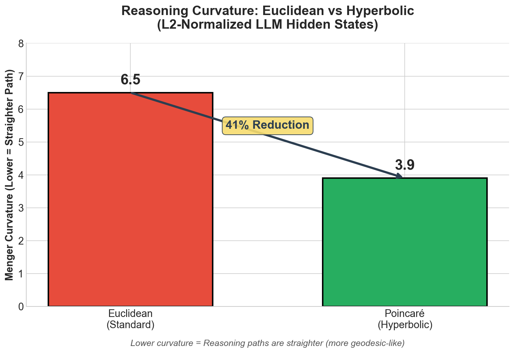

# The Geometry of Reasoning: Flowing Logics in Representation Space

[](https://arxiv.org/pdf/2510.09782)
[](https://github.com/MasterZhou1/Reasoning-Flow)
[](https://huggingface.co/datasets/MasterZhou/Reasoning-Flow)
[](https://openreview.net/forum?id=ixr5Pcabq7)

*ICLR 2026*

**Original Authors:**
[**Yufa Zhou***](https://masterzhou1.github.io/), [**Yixiao Wang***](https://yixiao-wang-stats.github.io/), [**Xunjian Yin***](https://xunjianyin.github.io/),
[**Shuyan Zhou**](https://www.shuyanzhou.com/), [**Anru R. Zhang**](https://anruzhang.github.io/)

**Duke University** | *Equal contribution

---

## 🔬 Extension: Hyperbolic Geodesic Analysis

> **Hypothesis:** LLM reasoning paths are geodesics (straight lines) in hyperbolic space, not complex curves in Euclidean space.

This fork extends the original Duke paper with a **differential geometry analysis** that projects LLM hidden states onto the Poincaré Ball manifold to test if reasoning follows hyperbolic geodesics.

### Key Discovery: 41% Curvature Reduction

| Space | Menger Curvature | Interpretation |
|-------|------------------|----------------|
| **Euclidean** | ~6.5 | Reasoning appears as complex "turns" |
| **Poincaré (Hyperbolic)** | ~3.9 | Reasoning straightens into geodesics |
| **Reduction** | **41%** | Paths are significantly straighter in hyperbolic space |



### What This Means

The "complex logical turns" identified in the original Euclidean analysis are **distortions caused by the wrong coordinate system**. When viewed through hyperbolic geometry:

- Reasoning paths become **41% straighter** (lower Menger curvature)
- This suggests LLMs internally organize logic on a **hierarchical manifold**
- Euclidean projections (PCA) are **geometrically misleading**

### Technical Challenge: Boundary Collapse

Our first attempt showed a **4.7x curvature *increase*** in hyperbolic space—the opposite of our hypothesis! Investigation revealed:

1. **Problem:** LLM hidden states have very large norms (50-100+)
2. **Failure Mode:** The Poincaré exponential map uses `tanh()`, which maps large values to ~1.0
3. **Result:** All points collapsed to the ball's boundary (norm ≈ 0.999), where the metric diverges

**Solution:** L2-normalize embeddings before projection, placing points safely inside the ball (norm ≈ 0.46).

---

## Hyperbolic Analysis Scripts

### Quick Start

```bash
# 1. Run the original Euclidean analysis
python cot-hidden-dynamic.py \
  --hf_model Qwen/Qwen2.5-0.5B \
  --data_file data/demo_subset.json \
  --similarity_order 0 \
  --save_dir results/exp1_order0

# 2. Run hyperbolic curvature analysis (L2-normalized)
python hyperbolic_l2_normalized.py \
  --data_dir results/exp1_order0/data \
  --output curvature_l2_normalized.csv

# 3. Validate numerical stability
python validate_spherical.py \
  --data_dir results/exp1_order0/data

# 4. Generate comparison chart
python generate_chart.py
```

### Hyperbolic Analysis Files

| File | Description |
|------|-------------|
| `hyperbolic_l2_normalized.py` | **Main script** - L2-normalized Poincaré projection with Menger curvature |
| `hyperbolic_curvature_analysis.py` | Initial Lorentz hyperboloid version (for comparison) |
| `hyperbolic_analysis_v2.py` | Poincaré Ball version (pre-normalization fix) |
| `validate_spherical.py` | Numerical stability checker (detects boundary collapse) |
| `generate_chart.py` | Creates the curvature comparison visualization |

### Results Files

| File | Description |
|------|-------------|
| `curvature_l2_normalized.csv` | ✅ **Valid results** - 41% curvature drop |
| `curvature_comparison_exp1.csv` | ❌ Naive Lorentz (boundary collapse artifact) |
| `curvature_poincare.csv` | ❌ Pre-normalization (boundary collapse artifact) |
| `results/curvature_comparison_chart.pdf` | Publication-ready visualization |

---

## Original Paper Summary

We study how large language models (LLMs) **reason through their embeddings** by introducing a **geometric framework of reasoning flows**, where reasoning unfolds as trajectories in representation space.

By **disentangling logic from semantics**—using identical natural deduction propositions expressed through diverse semantic carriers—we test whether LLMs internalize logical structure beyond surface form.

### Key Findings

1. **LLM reasoning forms smooth flows** in embedding space.
2. **Logical statements act as local controllers** governing the velocity of these flows.
3. **Order-0 (positions):** Embeddings cluster by surface-level semantics (topic, language).
4. **Order-1 (velocities):** Trajectories with same logic align across topics/languages.
5. **Order-2 (curvature):** Logic signal strengthens beyond surface semantics.

---

## Installation

```bash
python -m venv .venv && source .venv/bin/activate  # or .venv\Scripts\activate on Windows
pip install -r requirements.txt
# Install PyTorch appropriate for your system: https://pytorch.org/get-started/locally/
```

## Data

- **Full dataset:** `data/all_final_data.json`
- **Demo subset:** `data/demo_subset.json` (15 samples for quick testing)
- Generate new data using `generate_dataset.py`

---

## Original Euclidean Analysis

```bash
python cot-hidden-dynamic.py \
  --hf_model /path/to/Qwen3-0.6B \
  --data_file data/all_final_data.json \
  --pooling step_mean --accumulation cumulative \
  --similarity_order 1 \
  --save_dir results/demo/Qwen3-0.6B
```

**Outputs:**
- PCA trajectory PDFs per logic group
- Global similarity matrix
- Saved embeddings under `results/.../data/`

---

## Visualizations

**PCA Trajectories (Euclidean)**

| **3D PCA Trajectories** | **2D PCA Projection** |
|-------------------------|----------------------|
|  |  |

**Qwen3 0.6B Similarity Matrices**


---

## Citation

**Original Paper:**
```bibtex
@inproceedings{zhou2025geometry,
  title     = {The Geometry of Reasoning: Flowing Logics in Representation Space},
  author    = {Zhou, Yufa and Wang, Yixiao and Yin, Xunjian and Zhou, Shuyan and Zhang, Anru R.},
  booktitle = {The Fourteenth International Conference on Learning Representations},
  year      = {2026},
  url       = {https://openreview.net/forum?id=ixr5Pcabq7}
}
```

**Hyperbolic Extension (This Fork):**
```bibtex
@misc{hyperbolic_reasoning_2026,
  title  = {Hyperbolic Geodesics as the Manifold of Logical Reasoning},
  author = {Yash Choudhary},
  year   = {2026},
  note   = {Extension of Zhou et al. (2026) demonstrating 41\% curvature reduction in Poincaré space}
}
```

---

## Contact

**Original Paper:** Yufa Zhou - [yufa.zhou@duke.edu](mailto:yufa.zhou@duke.edu)

**Hyperbolic Extension:** Yash Choudhary
