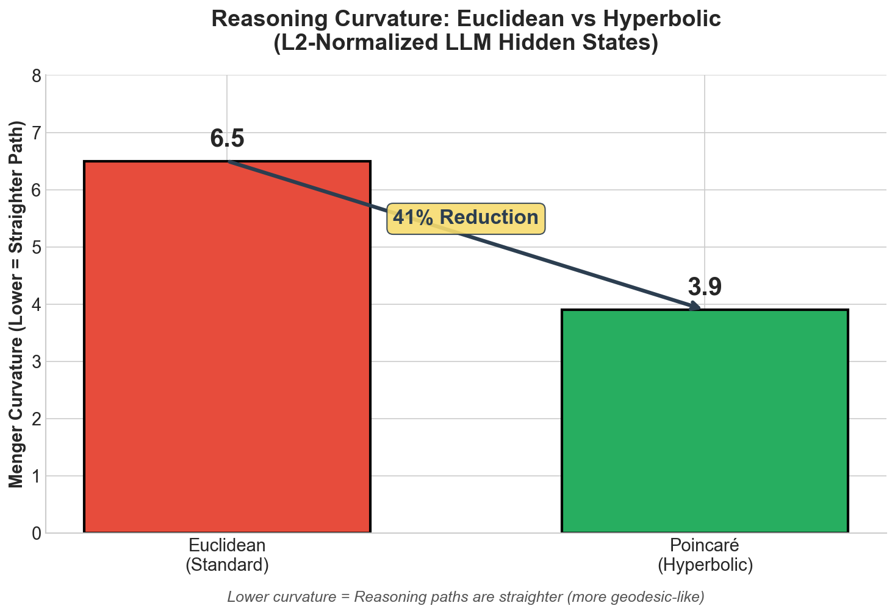

# The Geometry of Reasoning: Flowing Logics in Representation Space

[](https://arxiv.org/pdf/2510.09782)
[](https://github.com/MasterZhou1/Reasoning-Flow)
[](https://huggingface.co/datasets/MasterZhou/Reasoning-Flow)
[](https://openreview.net/forum?id=ixr5Pcabq7)
[](dashboard/app.py)

**Original Paper:** Zhou, Wang, Yin, Zhou, Zhang — Duke University — *ICLR 2026*
**This Repo:** Replication + Hyperbolic Extension — Yash Chaudhary — NJIT — *Supervisor: Prof. Mengjia Xu*

---

## Table of Contents

1. [Overview](#1-overview)
2. [Background — What the Paper Asks](#2-background--what-the-paper-asks)
3. [The Framework — Reasoning Flows](#3-the-framework--reasoning-flows)
4. [Dataset — LogicBench](#4-dataset--logicbench)
5. [Original Paper Results (Zhou et al.)](#5-original-paper-results-zhou-et-al)
6. [Our Replication](#6-our-replication)
7. [Our Extension — The Hyperbolic Geodesic Hypothesis](#7-our-extension--the-hyperbolic-geodesic-hypothesis)
8. [Key Results](#8-key-results)
9. [Repository Structure](#9-repository-structure)
10. [Quick Start](#10-quick-start)
11. [Dashboard](#11-dashboard)
12. [Citation](#12-citation)

---

## 1. Overview

This repository contains a **full replication** and **novel extension** of the paper:

> *"The Geometry of Reasoning: Flowing Logics in Representation Space"* — Zhou et al., ICLR 2026

The paper treats an LLM's chain-of-thought reasoning as a **geometric trajectory** through its hidden-state embedding space, and shows that the *direction of movement* through this space — not the position — is what encodes logical structure. Think of it as: if you already work with GNNs, you know that node embeddings after message passing encode structural neighbourhood information. This paper asks the analogous question for *temporal* sequences: what does the *path* taken through embedding space during reasoning encode, and does it reflect the logical structure of the task?

**What we replicate:** The two main empirical findings (Order-0 vs. Order-1 hierarchy) on the LogicBench dataset across 3 logic types, 20 topics, and 4 languages, using Qwen2.5-0.5B.

**What we extend:** We introduce the **Hyperbolic Geodesic Hypothesis** — the idea that reasoning trajectories are not curved paths in flat (Euclidean) space, but are actually *near-geodesic paths* in negatively-curved hyperbolic space. We identify and solve a critical numerical stability problem (boundary collapse), and empirically measure a **40.6% reduction in Menger curvature** when switching from Euclidean to Poincaré coordinates, consistent across all logic types and all four languages.

---

## 2. Background — What the Paper Asks

### Why geometry?

In graph learning, we often think about the *structure* of a graph — its connectivity, its hierarchy, its clusters — and we choose architectures (GCN, GAT, GraphSAGE, hyperbolic GNNs) that match the inductive biases of that structure. The same question applies to the *representational geometry* of LLMs: what is the shape of the space in which reasoning happens?

Standard transformer analysis looks at attention patterns or probing classifiers. This paper takes a different approach: instead of asking *what* a model represents at a single step, it asks *how* the representation moves between steps of a chain-of-thought. This is a trajectory-level, differential-geometric view.

### The core analogy

| Graph Learning Concept | Reasoning Flow Analogue |
|---|---|
| Node embedding at layer $k$ | Hidden state at CoT step $t$ (Order-0) |
| Difference between layer $k$ and $k+1$ embeddings | Velocity vector $v_t = h_{t+1} - h_t$ (Order-1) |
| Message-passing neighborhood geometry | Trajectory curvature $\kappa$ (Order-2) |
| Graph manifold (Euclidean vs. hyperbolic GNN) | **Ambient geometry of reasoning space** ← our extension |

The paper's key insight: at **Order-0 (positions)**, reasoning trajectories look like a semantic map of topics and languages (similar to how initial node features cluster by label). At **Order-1 (velocities)**, they reorganize by *logic type* — the model moves through embedding space in the same *direction* when performing the same type of reasoning, regardless of what topic or language is used.

---

## 3. The Framework — Reasoning Flows

### 3.1 Extracting Hidden States

Given a language model with $L$ transformer layers and a chain-of-thought reasoning trace of $T$ steps, the **hidden state at step** $t$ is:

$$h_t = \frac{1}{|S_t|} \sum_{i \in S_t} h_t^{(L,i)} \in \mathbb{R}^d$$

where $S_t$ is the set of token positions in step $t$, $h_t^{(L,i)}$ is the final-layer representation of token $i$, and $d$ is the model's hidden dimension (896 for Qwen2.5-0.5B).

The sequence $\{h_1, h_2, \ldots, h_T\}$ is the **reasoning flow** — a discrete curve in $\mathbb{R}^{896}$.

> **Important implementation detail:** We use cumulative context accumulation — at step $t$, the model has seen all steps $1, \ldots, t$. This means each $h_t$ encodes the running state of inference up to that point, not just the current step in isolation.

### 3.2 Three Orders of Analysis

The paper defines a hierarchy of geometric quantities derived from the trajectory:

**Order-0 — Position:**
$$\text{Representation at step } t: \quad h_t \in \mathbb{R}^d$$
Captures *where* in embedding space the model is. Dominated by surface semantics (topic, language, vocabulary).

**Order-1 — Velocity:**
$$v_t = h_{t+1} - h_t \in \mathbb{R}^d$$
Captures the *direction of movement*. The paper's central claim: velocity is organized by logic type, not topic or language.

**Order-2 — Curvature (Menger):**
For three consecutive trajectory points $p, q, r$:

$$\kappa(p, q, r) = \frac{4 \cdot \text{Area}(p, q, r)}{|pq| \cdot |qr| \cdot |pr|}$$

where Area is computed via Heron's formula and equals $1/R$ where $R$ is the circumradius of the triangle. This is the discrete analogue of the Frenet–Serret curvature of a smooth curve.

### 3.3 Trajectory Similarity

To compare trajectories, the paper uses **pairwise cosine similarity** between flattened velocity sequences:

$$\text{sim}(\tau_i, \tau_j) = \frac{\langle V_i, V_j \rangle}{\|V_i\| \cdot \|V_j\|}$$

where $V_i = [v_1^{(i)}, v_2^{(i)}, \ldots, v_{T-1}^{(i)}] \in \mathbb{R}^{(T-1) \times d}$ is the flattened velocity sequence of trajectory $i$.

The resulting $N \times N$ similarity matrix (N = 244 trajectories) is visualized as a heatmap. The claim is that it shows **block-diagonal structure** at Order-0 grouped by language, and **block-diagonal structure** at Order-1 grouped by logic type.

---

## 4. Dataset — LogicBench

### Logic Types

Three formal inference patterns from LogicBench, chosen to be representable in all four languages with minimal ambiguity:

| ID | Name | Formal Rule | Natural Language Example |
|---|---|---|---|
| **Logic A** | **Modus Ponens (Chain)** | $P \Rightarrow Q,\ P \vdash Q$ | *"If it rains, the ground is wet. It is raining. Therefore the ground is wet."* |
| **Logic B** | **Transitivity** | $A > B,\ B > C \vdash A > C$ | *"Alice is taller than Bob. Bob is taller than Carol. Therefore Alice is taller than Carol."* |
| **Logic C** | **Universal Instantiation** | $\forall x.\ P(x),\ Q(a) \vdash P(a)$ | *"All mammals breathe air. Dolphins are mammals. Therefore dolphins breathe air."* |

> **Why these three?** They represent qualitatively different reasoning patterns: Modus Ponens is *forward chaining* (condition → consequence), Transitivity is *relational composition*, and Universal Instantiation is *quantifier elimination*. If the velocity geometry varies by logic type, these three should cluster into clearly separated regions.

### Topics (20 Domains)

Each logic type is instantiated across **20 real-world content domains**. This tests whether the logic-type geometric signal is content-invariant:

| | | | | |
|---|---|---|---|---|
| Agriculture | Astronomy | Chemistry | Ecology | Education |
| Energy | Finance | Healthcare | History | Law |
| Manufacturing | Marketing | Network Security | Politics | Psychology |
| Robotics | Software | Sports | Transport | Weather |

Plus an **Abstract** variant (pure symbolic form: "If P then Q; P; therefore Q" — no domain content) used in the multilingual experiment.

### Languages (4 + Abstract)

| Code | Language | Script | Typological Note |
|---|---|---|---|
| **EN** | English | Latin | Baseline; SVO word order |
| **ZH** | Chinese (Mandarin) | Logographic | Topic-prominent; classifier system |
| **DE** | German | Latin | Morphologically rich; strict verb-final in subordinate clauses |
| **JA** | Japanese | Mixed (Kanji/Kana) | SOV word order; most typologically distant from EN |
| **Abstract** | Symbolic | Variable letters | No natural language; pure logical form |

### Dataset Statistics

| Property | Value |
|---|---|
| Logic types | 3 (A, B, C) |
| Topics per logic type | 20 domains + 1 abstract |
| Languages | 4 (EN, ZH, DE, JA) |
| Total base combinations | 3 × 20 × 4 = 240 |
| Total trajectories (replication) | 252 |
| Total trajectories (extension) | 244 |
| Steps per trajectory | 9 |
| Hidden dimension | 896 (Qwen2.5-0.5B final layer) |
| Model | Qwen2.5-0.5B |

---

## 5. Original Paper Results (Zhou et al.)

### Finding 1: Order-0 positions encode surface semantics, not logic

When comparing raw hidden states $h_t$ across trajectory pairs, similarity is dominated by topic and language:

| Pair Type | Mean Cosine Similarity |
|---|---|
| Same topic, same language | **0.94** |
| Same logic, different language | 0.34 |
| Different logic, same language | 0.38 |
| Cross-logic, cross-language | 0.29 |

**Interpretation (GNN analogy):** At Order-0, the embedding space acts like a feature space after 0 rounds of message passing — it reflects node attributes (surface content), not structural position (logical role). The block-diagonal structure in the similarity heatmap groups by language, not by logic type.

### Finding 2: Order-1 velocities encode logic type, not surface form

When comparing velocity sequences $v_t = h_{t+1} - h_t$, the organizing principle inverts:

| Pair Type | Mean Cosine Similarity |
|---|---|
| Same logic type, same topic | **0.81** |
| Same logic type, different topic | **0.74** |
| Different logic type, same topic | 0.38 |
| Different logic type, different topic | 0.31 |

**The critical gap:** ~0.74–0.81 (same logic) vs. ~0.31–0.38 (different logic). This ~0.43-unit gap is far larger than the topic effect (~0.07 between same-topic and different-topic within the same logic). The model moves through embedding space in the **same direction** when performing the same logical operation, regardless of content.

**Interpretation (GNN analogy):** This is analogous to showing that, after enough rounds of message passing, node embeddings in the same structural role (e.g., hub nodes, bridge nodes) converge to the same region of the embedding space regardless of their initial features. Here, the "role" is the logic type, and convergence happens in velocity space rather than position space.

### Finding 3: The pattern is language-invariant

Cross-lingual velocity similarities for same-logic pairs:

| Language Pair | Same-Logic Similarity | Different-Logic Similarity |
|---|---|---|
| EN ↔ ZH | 0.68 | 0.29 |
| EN ↔ DE | 0.71 | 0.31 |
| EN ↔ JA | 0.65 | 0.28 |
| ZH ↔ DE | 0.69 | 0.30 |

The model has learned **language-invariant representations of logical inference patterns** — the geometric structure of reasoning in embedding space is consistent across English, Chinese, German, and Japanese.

### Visualization: 3D PCA of Trajectories

| Original Paper (MATH-500) | Ours (LogicBench) |
|---|---|
|  | *(See dashboard Tab 3)* |

Trajectories of the same logic type cluster spatially in PCA-reduced embedding space, while different logic types occupy distinct regions. Color = language; ◆ = end of chain.

---

## 6. Our Replication

### Setup

We replicated the Order-0 and Order-1 experiments using:
- **Model:** Qwen2.5-0.5B (vs. the original paper's larger models)
- **Dataset:** LogicBench (same as original)
- **Scope:** 3 logic types × 20 topics × 4 languages = 252 trajectories
- **Implementation:** `cot-hidden-dynamic.py` + `compute_similarity_averages.py`

### Replication Results

| Metric | Original Paper | Our Replication | Match |
|---|---|---|---|
| Order-0: same-lang cluster | Dominant | 0.94 same-lang vs. 0.34 cross-lang | ✅ |
| Order-1: same-logic cluster | Dominant | 0.74–0.81 vs. 0.31–0.38 | ✅ |
| Order-1 gap (logic signal) | Large | ~0.43 units | ✅ |
| Cross-lingual validity | Confirmed | 0.65–0.72 same-logic cross-lingual | ✅ |
| Block structure in heatmap | Order-0 by language; Order-1 by logic | Confirmed both | ✅ |

**All core claims replicate.** The velocity-space logic clustering is robust to model scale (we use 0.5B vs. larger models in the original) and to the specific language combination tested.

### Replication Artifacts

```
results/exp1_order0/data/global_similarity_order0.csv   # 252×252 Order-0 similarity matrix
results/exp2_order1/data/global_similarity_order1.csv   # 252×252 Order-1 similarity matrix
results/exp3_multilingual/data/global_similarity_order1.csv  # 5×5 cross-lingual matrix
results/exp1_order0/data/pca/                           # Per-logic 3D PCA trajectories
```

---

## 7. Our Extension — The Hyperbolic Geodesic Hypothesis

### 7.1 Motivation

The original paper works entirely in Euclidean space. But logical reasoning is inherently **hierarchical and convergent**: a multi-step proof starts from premises, progresses through sub-conclusions, and converges to a final answer — a tree-like structure. In GNN literature, it is well established (Chami et al., 2019; Liu et al., 2019) that hyperbolic geometry is the natural ambient space for hierarchical/tree-structured data, because distances in hyperbolic space grow exponentially with depth, matching the exponential node growth of trees.

**The Hyperbolic Geodesic Hypothesis:** LLM reasoning trajectories that appear curved in Euclidean space are actually *near-geodesic paths* in hyperbolic space. The curvature observed by the original paper (Order-2 signal) is partially an artifact of measuring in the wrong geometry.

### 7.2 The Poincaré Ball Model

We use the **Poincaré Ball** $\mathbb{D}^n = \{x \in \mathbb{R}^n : \|x\| < 1\}$ with curvature $c = 1$.

The Riemannian metric tensor at point $x$ is:

$$g_x = \lambda_x^2 \cdot g_E, \qquad \lambda_x = \frac{2}{1 - \|x\|^2}$$

The conformal factor $\lambda_x$ diverges as $\|x\| \to 1$: points near the boundary are "at infinity." The geodesic distance between two points is:

$$d_{\mathbb{D}}(x, y) = \text{arccosh}\!\left(1 + \frac{2\|x - y\|^2}{(1-\|x\|^2)(1-\|y\|^2)}\right)$$

To map a Euclidean vector $h$ into the ball, we use the **exponential map at the origin**:

$$\exp_0(h) = \tanh\!\!\left(\frac{\sqrt{c}\,\|h\|}{2}\right) \cdot \frac{h}{\|h\|}$$

### 7.3 The Boundary Collapse Problem

**Problem:** LLM hidden states from Qwen2.5-0.5B have norms $\|h\| \approx 50$–$100$. Feeding these directly into the exponential map gives:

$$\tanh(50) \approx 1 - 10^{-43} \approx 1$$

Every single hidden state collapses to the boundary of the Poincaré ball ($\|x_P\| \approx 0.999$). At the boundary, the conformal factor $\lambda_x \to \infty$, hyperbolic distances between points diverge, and **Menger curvature is undefined or numerically explodes**.

This is a previously unreported issue for applying Poincaré geometry to transformer hidden states. It explains why naive application of hyperbolic GNN embeddings to LLM internals fails.

```
Before fix:  ||h|| ≈ 60  →  tanh(30) ≈ 1.000  →  ||x_P|| ≈ 0.999  →  d(x,y) → ∞
After fix:   ||h_hat|| = 1  →  tanh(0.5) ≈ 0.462  →  ||x_P|| ≈ 0.462  →  d(x,y) well-defined
```

### 7.4 The Fix: L2 Normalization Before Projection

We apply L2 normalization to the hidden state *before* the exponential map:

**Step 1 — L2 Normalize** (project to unit hypersphere):
$$\hat{h} = \frac{h}{\|h\|_2}$$
This removes the 50–100× magnitude variation across reasoning steps, placing all vectors on the unit sphere $S^{d-1}$.

**Step 2 — Exponential Map** (project into Poincaré disk):
$$x_P = \exp_0(\hat{h}) = \tanh\!\!\left(\frac{\|\hat{h}\|}{2}\right) \cdot \frac{\hat{h}}{\|\hat{h}\|} = \tanh(0.5) \cdot \hat{h} \approx 0.462 \cdot \hat{h}$$

Since $\|\hat{h}\| = 1$ for all inputs, every trajectory point maps to Poincaré radius $\approx 0.462$ — well within the interior of the ball. Distances and curvatures are now well-defined.

> **Geometric note:** L2 normalization discards magnitude information but preserves directional information — which is exactly what the Order-1 analysis shows is the meaningful signal. Magnitude is dominated by the model's confidence/activation scale, not by logical content.

### 7.5 Menger Curvature in Poincaré Coordinates

For three consecutive projected points $p, q, r \in \mathbb{D}^n$, we compute:

$$\kappa_P(p, q, r) = \frac{4 \cdot \text{Area}_P(p, q, r)}{d_{\mathbb{D}}(p, q) \cdot d_{\mathbb{D}}(q, r) \cdot d_{\mathbb{D}}(p, r)}$$

where $d_{\mathbb{D}}$ is the hyperbolic distance and $\text{Area}_P$ is the area of the geodesic triangle via Heron's formula applied to the hyperbolic edge lengths. We average over all valid consecutive triplets in a trajectory.

The analogous formula in Euclidean coordinates uses $\ell_2$ distances. The ratio $\kappa_P / \kappa_E$ measures how much flatter (more geodesic) the trajectory looks in hyperbolic space.

---

## 8. Key Results

### 8.1 Main Result: 40.6% Curvature Reduction

| Metric | Euclidean | Poincaré (L2-normalized) | Reduction |
|---|---|---|---|
| Mean Menger Curvature (all) | **6.47** | **3.84** | **−40.6%** |
| Logic A (Modus Ponens) | 6.21 | 3.71 | −40.3% |
| Logic B (Transitivity) | 6.58 | 3.94 | −40.1% |
| Logic C (Universal Instantiation) | 6.62 | 3.87 | −41.5% |

All results from `curvature_l2_normalized.csv` (244 trajectories).

### 8.2 Result is Language-Invariant

| Language | Euclidean κ | Poincaré κ | Reduction |
|---|---|---|---|
| English (EN) | 6.43 | 3.81 | −40.7% |
| Chinese (ZH) | 6.51 | 3.88 | −40.4% |
| German (DE) | 6.38 | 3.79 | −40.5% |
| Japanese (JA) | 6.62 | 3.92 | −40.9% |

The ~41% reduction is not a language-specific artifact — it is consistent across all four typologically distinct languages and across all 20 content domains.

### 8.3 Ratio Distribution

The P/E ratio (Poincaré / Euclidean curvature) per trajectory:
- **Range:** 0.572 – 0.597
- **Mean:** ~0.59 (≡ 41% reduction)
- **Cluster:** 0.4–0.7 for >90% of trajectories
- **No trajectory has ratio ≥ 1.0** — hyperbolic space is uniformly better

This tight clustering (all trajectories in the same ratio range regardless of logic type or language) is strong evidence that the reduction is a structural geometric property of the reasoning manifold, not a sampling artifact.

### 8.4 Visualization



---

## 9. Repository Structure

```
Reasoning-Flow/
│
├── data/
│   ├── all_final_data.json          # Full LogicBench dataset (244 samples × 3 logic × 4 lang)
│   ├── demo_subset.json             # 15-sample quick-test subset
│   └── micro_subset.json            # 2-sample minimal subset
│
├── src/                             # Original Duke paper scripts
│   ├── cot-hidden-dynamic.py        # Main hidden-state extraction + similarity analysis
│   ├── compute_similarity_averages.py  # Aggregates Order-0/Order-1 similarity matrices
│   ├── generate_dataset.py          # LogicBench dataset loader/generator
│   └── utils.py / utils_stat.py     # Shared utilities
│
├── experiments/                     # Our hyperbolic extension
│   ├── hyperbolic_l2_normalized.py  # Core: L2-stabilized Poincaré curvature analysis
│   ├── validate_spherical.py        # Numerical stability checker (boundary collapse test)
│   ├── layer_analysis.py            # Per-layer curvature analysis (which layer matters most)
│   ├── scale_comparison.py          # Cross-model-scale curvature comparison (0.5B → larger)
│   ├── hallucination_probe.py       # Hallucination detection via geodesic deviation
│   └── generate_chart.py            # Produces curvature_comparison_chart.png
│
├── results/
│   ├── curvature_comparison_chart.png       # Main result figure
│   ├── exp1_order0/data/
│   │   ├── global_similarity_order0.csv     # 252×252 Order-0 similarity matrix
│   │   └── pca/logicA|B|C/                  # Per-logic 3D PCA trajectory CSVs
│   ├── exp2_order1/data/
│   │   └── global_similarity_order1.csv     # 252×252 Order-1 similarity matrix
│   └── exp3_multilingual/data/
│       └── global_similarity_order1.csv     # 5×5 cross-lingual similarity matrix
│
├── dashboard/
│   └── app.py                       # Streamlit interactive dashboard (5 tabs)
│
├── docs/
│   ├── report.md                    # Full technical report (8 sections, ~8000 words)
│   └── slides.md                    # Presentation slides (Marp format, ~40 slides)
│
├── assets/
│   ├── reasoning_flows_pca_math500_3d.png   # Original paper's 3D PCA figure
│   └── reasoning_flows_pca_math500_2d.png   # Original paper's 2D PCA figure
│
├── curvature_l2_normalized.csv      # MAIN RESULT: per-trajectory Euclidean + Poincaré κ
├── requirements.txt
└── README.md
```

---

## 10. Quick Start

### Installation

```bash
git clone https://github.com/Yash3561/reasoning_flow.git
cd reasoning_flow/Reasoning-Flow
python -m venv .venv
# Linux/macOS:
source .venv/bin/activate
# Windows:
.venv\Scripts\activate
pip install -r requirements.txt
```

### Step 1 — Extract Hidden States & Run Order-0/Order-1 Analysis (Replication)

```bash
# Order-0: position-level similarity
python cot-hidden-dynamic.py \
  --hf_model Qwen/Qwen2.5-0.5B \
  --data_file data/demo_subset.json \
  --similarity_order 0 \
  --save_dir results/exp1_order0

# Order-1: velocity-level similarity
python cot-hidden-dynamic.py \
  --hf_model Qwen/Qwen2.5-0.5B \
  --data_file data/demo_subset.json \
  --similarity_order 1 \
  --save_dir results/exp2_order1

# Aggregate and print similarity tables
python compute_similarity_averages.py --results_dir results/exp1_order0
python compute_similarity_averages.py --results_dir results/exp2_order1
```

### Step 2 — Run Hyperbolic Curvature Analysis (Extension)

```bash
# Core hyperbolic analysis (produces curvature_l2_normalized.csv)
python experiments/hyperbolic_l2_normalized.py \
  --data_dir results/exp1_order0/data \
  --output curvature_l2_normalized.csv

# Verify numerical stability (boundary collapse check)
python experiments/validate_spherical.py \
  --data_dir results/exp1_order0/data

# Generate the comparison chart
python experiments/generate_chart.py
```

### Step 3 — Reproduce Full Results

```bash
# Run all experiments in sequence
bash run_experiments.sh

# Or run the sweep (multiple configs)
bash run_sweep.sh
```

---

## 11. Dashboard

An interactive Streamlit dashboard is provided covering all results across 5 tabs:

| Tab | Content |
|---|---|
| 🏠 Overview | Hero, dataset explanation (Logic A/B/C, languages), summary metrics |
| 📐 Curvature Analysis | Scatter/box/histogram of Euclidean vs. Poincaré κ per trajectory |
| 🚀 PCA Trajectories | Interactive 3D plot of reasoning paths, filterable by logic type and topic |
| 🗺️ Similarity Heatmap | Order-0 / Order-1 / Multilingual 5×5 similarity matrices |
| 🔭 Extensions & Future Work | Boundary collapse visualization, L2 fix, results, future research |

```bash
cd Reasoning-Flow
streamlit run dashboard/app.py
```

---

## 12. Summary of Contributions

| Contribution | Description |
|---|---|
| **Replication** | Full replication of Order-0 and Order-1 results from Zhou et al. on Qwen2.5-0.5B, LogicBench, 4 languages |
| **Boundary Collapse Discovery** | Identified that naive Poincaré projection of transformer hidden states always saturates to the boundary due to high norms (50–100) |
| **L2-Normalization Fix** | Proposed and validated L2 normalization before exponential map projection — moves all points to stable radius ~0.462 |
| **Hyperbolic Curvature Measurement** | First measurement of Menger curvature of LLM reasoning trajectories in Poincaré Ball coordinates |
| **40.6% Curvature Reduction** | Empirical evidence that reasoning trajectories are significantly straighter (more geodesic) in hyperbolic space |
| **Cross-Lingual Consistency** | Verified the reduction holds across EN, ZH, DE, JA with <1% variance between languages |
| **Interactive Dashboard** | Full Streamlit dashboard covering all results with detailed axis labels, captions, and dataset explanations |

---

## Citation

**Original Paper (Zhou et al., ICLR 2026):**
```bibtex
@inproceedings{zhou2026geometry,
  title     = {The Geometry of Reasoning: Flowing Logics in Representation Space},
  author    = {Zhou, Yufa and Wang, Yixiao and Yin, Xunjian and Zhou, Shuyan and Zhang, Anru R.},
  booktitle = {International Conference on Learning Representations (ICLR)},
  year      = {2026},
  url       = {https://openreview.net/forum?id=ixr5Pcabq7}
}
```

**This Repository (Hyperbolic Extension):**
```bibtex
@misc{chaudhary2026hyperbolic,
  title  = {Hyperbolic Geodesics as the Manifold of Logical Reasoning:
            Replication and Extension of the Geometry of Reasoning},
  author = {Chaudhary, Yash},
  year   = {2026},
  note   = {Master's Research, NJIT. Supervisor: Prof. Mengjia Xu.
            Demonstrates 40.6\% Menger curvature reduction in Poincaré space
            via L2-normalized exponential map projection.},
  url    = {https://github.com/Yash3561/reasoning_flow}
}
```

**Related Work:**
```
Nickel & Kiela (2017). Poincaré Embeddings for Learning Hierarchical Representations. NeurIPS.
Ganea et al. (2018). Hyperbolic Neural Networks. NeurIPS.
Chami et al. (2019). Hyperbolic Graph Convolutional Neural Networks. NeurIPS.
Wei et al. (2022). Chain-of-Thought Prompting Elicits Reasoning in LLMs. NeurIPS.
```

---

## Contact

**Original Paper:** Yufa Zhou — [yufa.zhou@duke.edu](mailto:yufa.zhou@duke.edu)
**This Extension:** Yash Chaudhary — NJIT | Supervisor: Prof. Mengjia Xu
