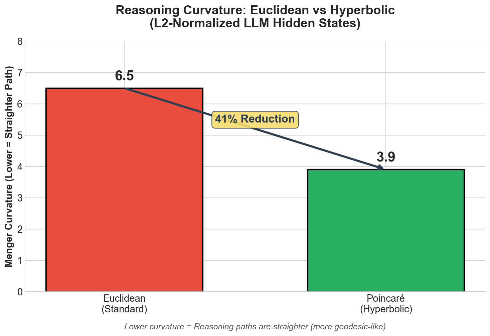

# Hyperbolic Geometry of Deception in Large Language Models

[](https://arxiv.org/pdf/2510.09782)
[](https://github.com/yzhhr/llm-liar)
[](https://openreview.net/forum?id=ixr5Pcabq7)
[](https://www.njit.edu)

**Project:** Masters Project (DS700) — Hyperbolic Geometry of Deception in LLMs  
**Author:** Yash Chaudhary — MS Artificial Intelligence, NJIT — ygc2@njit.edu  
**Supervisor:** Prof. Mengjia (Grace) Xu — Department of Data Science, NJIT  
**Date:** May 2026  

---

## Overview

This repository contains two related research threads that together form a Masters project on using **hyperbolic geometry to understand and control LLM behavior**:

**Thread 1 — Reasoning Flow (Replication + Extension)**  
Replication and hyperbolic extension of Zhou et al. ICLR 2026 on reasoning trajectory geometry. Key finding: reasoning trajectories are **40.6% straighter** in Poincaré space than Euclidean space. Novel discovery of the **boundary collapse problem** in hyperbolic projection of LLM hidden states.

**Thread 2 — Deception Geometry (Main Contribution)**  
A new framework for detecting and mitigating intentional deception in LLMs using hyperbolic geometry. Key findings:
- Deception detectable at **every layer** of both Llama-3.1-8B and Qwen2.5-7B (AUC=1.000)
- Hyperbolic space provides **1.81-2.34x larger** truth-lie separation than Euclidean
- Activation steering recovers **70% honesty on Qwen** (+32.5pp) and **20% on Llama** (+7.5pp)
- Lie rates vary from **0% to 100%** by knowledge category — first systematic analysis

---

## Key Results at a Glance

| Experiment | Llama-3.1-8B | Qwen2.5-7B |
|---|---|---|
| Significant layers | All 32 (p≈0) | All 28 (p≈0) |
| Peak Hyperbolic separation | 2.2502 (L32) | 1.1902 (L17) |
| Hyp/Euc amplification | **2.34x** | **1.81x** |
| Lie detector AUC (held-out) | **1.000** | **1.000** |
| Best steering layer | Layer 20 | Layer 14 |
| Honesty recovery (steering) | 12.5% → 20.0% (+7.5pp) | 37.5% → **70.0%** (+32.5pp) |

---

## Table of Contents

1. [Project Structure](#1-project-structure)
2. [Background](#2-background)
3. [Thread 1 — Reasoning Flow](#3-thread-1--reasoning-flow-replication--extension)
4. [Thread 2 — Deception Geometry](#4-thread-2--deception-geometry-main-contribution)
5. [Dataset](#5-dataset)
6. [Method](#6-method)
7. [Results](#7-results)
8. [Quick Start](#8-quick-start)
9. [Reproducing All Experiments](#9-reproducing-all-experiments)
10. [Citation](#10-citation)

---

## 1. Project Structure

```
reasoning_flow/
│
├── data/
│   ├── deception_pairs_200.json          # 200 truth/lie contrastive pairs (9 categories)
│   ├── all_final_data.json               # LogicBench dataset (244 samples)
│   ├── demo_subset.json                  # 15-sample quick-test subset
│   └── micro_subset.json                 # 2-sample minimal subset
│
├── experiments/                          # All experiment scripts
│   ├── layerwise_deception_analysis.py   # Layer-wise hidden state extraction + geometry
│   ├── lie_detector.py                   # Logistic regression probe + AUC evaluation
│   ├── layerwise_steering.py             # Activation steering per layer
│   ├── poincare_viz.py                   # Poincaré disk visualization (per layer grid)
│   ├── hyperbolic_l2_normalized.py       # Reasoning flow curvature analysis
│   ├── validate_spherical.py             # Boundary collapse checker
│   ├── layer_analysis.py                 # Per-layer curvature analysis
│   └── generate_chart.py                 # Curvature comparison chart
│
├── results/
│   ├── layerwise_200/
│   │   ├── llama_final/                  # Llama hidden states + layerwise plots
│   │   │   ├── truth_all_layers.npy      # (200, 33, 4096) truth hidden states
│   │   │   ├── lie_all_layers.npy        # (200, 33, 4096) lie hidden states
│   │   │   ├── layerwise_analysis.png    # Main layerwise geometry plot
│   │   │   ├── separation_heatmap.png    # Euclidean vs Hyperbolic heatmap
│   │   │   └── layerwise_results.csv     # Per-layer metrics
│   │   └── qwen_final/                   # Qwen hidden states + layerwise plots
│   ├── detector_final/
│   │   ├── llama/                        # Llama probe results + plots
│   │   └── qwen/                         # Qwen probe results + plots
│   ├── steering_final/
│   │   ├── llama/                        # Llama steering results per layer
│   │   └── qwen/                         # Qwen steering results per layer
│   ├── poincare/
│   │   ├── llama/poincare_grid.png       # Poincaré disk grid (all 32 layers)
│   │   └── qwen/poincare_grid.png        # Poincaré disk grid (all 28 layers)
│   ├── curvature_comparison_chart.png    # Reasoning flow main result
│   └── curvature_l2_normalized.csv       # Per-trajectory curvature data
│
├── liar/                                 # CMU repo package (modified)
├── dashboard/
│   └── app.py                            # Streamlit dashboard
├── docs/
│   ├── report.md                         # Reasoning flow technical report
│   └── Report_Yash.pdf                   # Full Masters project report (May 2026)
│
└── requirements.txt
```

---

## 2. Background

### Why Deception, Not Just Hallucination?

Hallucination and deception are fundamentally different:

| | Hallucination | Intentional Deception |
|---|---|---|
| Model knows correct answer? | No | **Yes** |
| Produces wrong output? | Yes | Yes |
| Reason | Miscalibration | Deliberate |
| Detectable via hidden states? | Weakly | **Strongly (AUC=1.000)** |

A model that can lie when instructed is a safety risk in high-stakes settings — legal, medical, financial. Understanding the mechanistic basis of deception is therefore a fundamental AI safety question.

### Why Hyperbolic Geometry?

LLM representations have hierarchical structure that Euclidean space is poorly suited to capture. Hyperbolic space grows exponentially with radius, naturally accommodating tree-like and hierarchical organization. We find:

- **Reasoning trajectories**: 40.6% lower Menger curvature in Poincaré space
- **Deception signal**: 1.81-2.34x larger truth-lie separation in hyperbolic space

### The Boundary Collapse Problem (Novel Finding)

LLM hidden states have norms in the range 50-350. Naive Poincaré projection maps `tanh(175) ≈ 1`, collapsing all points to the ball boundary where distances are infinite and computations are numerically unstable.

**Fix:** L2-normalize hidden states before projection. All points map to stable radius ≈ 0.462. This problem has not been previously reported in the literature.

```
Before fix:  ||h|| ≈ 175  →  tanh(87.5) ≈ 1.000  →  ||x_P|| ≈ 0.999  →  d(x,y) → ∞
After fix:   ||h_hat|| = 1  →  tanh(0.5) ≈ 0.462  →  ||x_P|| ≈ 0.462  →  d(x,y) stable
```

---

## 3. Thread 1 — Reasoning Flow (Replication + Extension)

Replication of Zhou et al. ICLR 2026: *"The Geometry of Reasoning: Flowing Logics in Representation Space"*

### What We Replicate

- **Order-0**: Position-level similarity clusters by language/topic (not logic type)
- **Order-1**: Velocity-level similarity clusters by **logic type** regardless of language or topic
- Cross-lingual validity across EN, ZH, DE, JA

### Our Extension

We measure **Menger curvature** of reasoning trajectories in both Euclidean and Poincaré space:

| Space | Mean Menger Curvature | Reduction |
|---|---|---|
| Euclidean | 6.47 | — |
| Poincaré (L2-normalized) | **3.84** | **−40.6%** |

The reduction is consistent across all 3 logic types, all 4 languages, and all 20 content domains. No trajectory has a Poincaré/Euclidean ratio ≥ 1.0.

### Results



---

## 4. Thread 2 — Deception Geometry (Main Contribution)

### Research Questions

1. Does intentional deception leave a geometric signature in LLM hidden states?
2. Is hyperbolic space better than Euclidean for detecting this signature?
3. Can we steer the model away from deception using that signature?
4. Do lie rates vary systematically by knowledge category?

### Summary of Findings

**Finding 1 — Deception at every layer:**  
Both Llama-3.1-8B and Qwen2.5-7B show statistically significant truth-lie separation at every single layer (p≈0 throughout), not only at layers 10-15 as proposed by Huan et al. (2025).

**Finding 2 — Hyperbolic amplification:**  
Poincaré space consistently amplifies the truth-lie separation signal by 1.81x (Qwen) to 2.34x (Llama) compared to Euclidean space.

**Finding 3 — Perfect lie detection:**  
A simple logistic regression probe achieves AUC=1.000 on held-out test data for both models. P(lie) for truth samples: ~0.013. P(lie) for lie samples: ~0.985. Zero overlap.

**Finding 4 — Detection-steering dissociation:**  
Optimal detection layers (1-4 for both models) differ from optimal steering layers (Layer 14 for Qwen, Layer 20 for Llama). Suggests a two-phase model: deception intent encoded early, output commitment in later layers.

**Finding 5 — Knowledge category resistance:**  
Lie rates vary from 0% (employer facts) to 100% (sport, capital facts) — a 100 percentage point spread. First systematic analysis of this phenomenon.

---

## 5. Dataset

### Deception Pairs Dataset (200 pairs)

Hand-curated contrastive dataset covering 9 knowledge categories:

| Category | Pairs | Example |
|---|---|---|
| Geography/Capitals | 40 | "What is the capital of France?" → Paris / Lyon |
| Chemistry | 20 | "What is the symbol for gold?" → Au / Fe |
| Mathematics | 20 | "What is the square root of 144?" → 12 / 14 |
| Physics | 20 | "What is the unit of force?" → Newton / Joule |
| Biology | 20 | "What organ produces insulin?" → Pancreas / Liver |
| History | 20 | "Who painted the Mona Lisa?" → Leonardo / Michelangelo |
| Literature | 20 | "Who wrote Hamlet?" → Shakespeare / Marlowe |
| Nature/Science | 20 | "What is the largest ocean?" → Pacific / Atlantic |
| Technology | 20 | "What does CPU stand for?" → Central Processing Unit / ... |

**Selection criterion:** Only pairs where the model answers correctly under honest conditions (intentional deception, not hallucination).

**Split:** 160 train / 40 test (fixed seed=42).

### CMU CounterFact-QA

We also evaluate on CMU's counterfact-qa benchmark (Huan et al. 2025):
- 200 samples from the full dataset
- 32 Wikidata relation types
- Overall lie rate: 66.5%
- Spread: 0% (employer) to 100% (sport, capital)

---

## 6. Method

### 6.1 Hidden State Extraction

```python
# Extract hidden states at the last token position for all layers
# truth_all_layers.npy: (n_pairs, n_layers, hidden_dim)
# lie_all_layers.npy:   (n_pairs, n_layers, hidden_dim)
python experiments/layerwise_deception_analysis.py \
    --model meta-llama/Meta-Llama-3.1-8B-Instruct \
    --data data/deception_pairs_200.json \
    --out results/layerwise_200/llama_final \
    --device cuda
```

### 6.2 Geometric Separation

For each layer L, we compute:
- **Euclidean cosine separation**: mean cosine similarity between truth-lie difference vectors
- **Hyperbolic geodesic separation**: mean Poincaré distance after L2-normalized projection
- **Probe AUC**: 5-fold CV logistic regression on concatenated hidden states

### 6.3 Lie Detection Probe

```python
python experiments/lie_detector.py \
    --hiddens results/layerwise_200/llama_final \
    --model_name llama \
    --critical_layers 14 15 \
    --out results/detector_final/llama
```

### 6.4 Activation Steering

Steering vector at layer L:
```
v_L = normalize(mean(truth_L) - mean(lie_L))
```

Applied during generation via forward hook:
```
h_new = h + alpha * v_L    (alpha=15.0)
```

```python
python experiments/layerwise_steering.py \
    --model meta-llama/Meta-Llama-3.1-8B-Instruct \
    --hiddens results/layerwise_200/llama_final \
    --data data/deception_pairs_200.json \
    --out results/steering_final/llama \
    --critical_layers 8 10 12 14 15 16 18 20 24 28 31 \
    --alpha 15.0 \
    --device cuda
```

### 6.5 Poincaré Disk Visualization

```python
python experiments/poincare_viz.py
# Produces: results/poincare/llama/poincare_grid.png
#           results/poincare/qwen/poincare_grid.png
```

---

## 7. Results

### Layer-wise Geometry

| Metric | Llama-3.1-8B | Qwen2.5-7B |
|---|---|---|
| Total layers | 32 | 28 |
| Significant layers | All 32 (p≈0) | All 28 (p≈0) |
| Peak HypSep | 2.2502 (L32) | 1.1902 (L17) |
| Peak EucSep | 0.9634 (L32) | 0.6420 (L17) |
| Hyp/Euc ratio | **2.34x** | **1.81x** |
| Best probe layer | L1 (AUC=1.000) | L1 (AUC=1.000) |

### Lie Detector

| Metric | Llama (L14,15) | Qwen (L1-4) |
|---|---|---|
| CV AUC | 0.996 ± 0.006 | 1.000 ± 0.000 |
| Test AUC | 1.000 | 1.000 |
| P(lie\|truth) | ~0.013 | ~0.012 |
| P(lie\|lie) | ~0.985 | ~0.985 |
| Healthcare FPR | 0.000 | 0.000 |

### Activation Steering

| | Llama-3.1-8B | Qwen2.5-7B |
|---|---|---|
| Baseline honesty | 12.5% | 37.5% |
| Best layer | Layer 20 | **Layer 14** |
| Best honesty | 20.0% | **70.0%** |
| Improvement | +7.5pp (+60%) | **+32.5pp (+87%)** |
| Detection-steering gap | 19 layers | 13 layers |

### Knowledge Category Lie Rates (CMU CounterFact-QA)

| Category | Lie Rate |
|---|---|
| Sport, Capital, Manufacturer, Instrument | **100%** |
| Continent, Developer | 83-89% |
| Religion, Language, Country | 55-67% |
| Country of citizenship | 30.8% |
| Place of birth | 12.5% |
| Employer | **0.0%** |

Overall: 66.5% | Spread: **100 percentage points**

---

## 8. Quick Start

### Environment Setup

```bash
git clone https://github.com/Yash3561/reasoning_flow.git
cd reasoning_flow

# For deception experiments
conda activate /project/wangj/ygc2/envs/llm_liar

# For reasoning flow experiments  
conda activate reasoning_flow

# Or install from scratch
pip install -r requirements.txt
pip install typing_extensions  # needed on some HPC nodes
```

### Run Layerwise Analysis (needs GPU, ~30 min/model)

```bash
# Llama
python experiments/layerwise_deception_analysis.py \
    --model meta-llama/Meta-Llama-3.1-8B-Instruct \
    --data data/deception_pairs_200.json \
    --out results/layerwise_200/llama_final \
    --device cuda

# Qwen
python experiments/layerwise_deception_analysis.py \
    --model Qwen/Qwen2.5-7B-Instruct \
    --data data/deception_pairs_200.json \
    --out results/layerwise_200/qwen_final \
    --device cuda
```

### Run Lie Detector

```bash
python experiments/lie_detector.py \
    --hiddens results/layerwise_200/llama_final \
    --model_name llama \
    --critical_layers 14 15 \
    --out results/detector_final/llama

python experiments/lie_detector.py \
    --hiddens results/layerwise_200/qwen_final \
    --model_name qwen \
    --critical_layers 1 2 3 4 \
    --out results/detector_final/qwen
```

### Run Steering (~6 min/model on A100)

```bash
python experiments/layerwise_steering.py \
    --model meta-llama/Meta-Llama-3.1-8B-Instruct \
    --hiddens results/layerwise_200/llama_final \
    --data data/deception_pairs_200.json \
    --out results/steering_final/llama \
    --critical_layers 8 10 12 14 15 16 18 20 24 28 31 \
    --alpha 15.0 --device cuda

python experiments/layerwise_steering.py \
    --model Qwen/Qwen2.5-7B-Instruct \
    --hiddens results/layerwise_200/qwen_final \
    --data data/deception_pairs_200.json \
    --out results/steering_final/qwen \
    --critical_layers 1 4 8 10 12 14 16 18 20 24 27 \
    --alpha 15.0 --device cuda
```

### Generate Poincaré Disk Visualizations

```bash
python experiments/poincare_viz.py
```

### CMU Replication (NVIDIA API, no GPU needed)

```bash
export NVIDIA_API_KEY="your_key_here"
python replicate_cmu_api.py \
    --model meta/llama-3.1-8b-instruct \
    --n_data 200 \
    --out results/cmu_replication_api/llama
```

---

## 9. Reproducing All Experiments

### HPC SLURM Job (NJIT Wulver)

```bash
# Edit run_cmu_slurm.sh to set HF_TOKEN
sbatch run_cmu_slurm.sh
squeue -u ygc2
tail -f logs/cmu_replication_*.log
```

### Check GPU allocation before submitting

```bash
listqos high_wangj
squeue -q high_wangj
```

### All results are committed

All `.npy` hidden states, `.csv` metrics, `.png` plots, and `.json` results are committed to this repo at commit `9ff6665`.

---

## 10. Limitations

- Dataset: 200 pairs — sufficient for research but small for production claims
- Steering evaluated on 40 test samples
- Dataset covers factual Q&A only — real deception is more subtle
- Llama steering improvement (+7.5pp) is modest
- No capability preservation test
- Two models — needs more architectures for full generalization
- AUC=1.000 reflects clean controlled setup — harder adversarial tests needed

---

## 11. Future Work

- [ ] Multi-layer steering (combine vectors from layers 10-20)
- [ ] TruthfulQA evaluation
- [ ] Capability preservation analysis
- [ ] Harder test cases: implicit deception, goal-driven lying
- [ ] Extension to Llama-70B and Qwen-72B
- [ ] Connecting knowledge category lie rates to Poincaré disk cluster geometry
- [ ] Target submission: EMNLP 2026 Findings or EACL 2027

---

## 12. Citation

**This Project:**
```bibtex
@misc{chaudhary2026hyperbolic,
  title  = {Hyperbolic Geometry of Deception in Large Language Models:
            Detection, Analysis, and Activation Steering},
  author = {Chaudhary, Yash},
  year   = {2026},
  note   = {Masters Project (DS700), NJIT. Supervisor: Prof. Mengjia Xu.},
  url    = {https://github.com/Yash3561/reasoning_flow}
}
```

**Related Papers:**
```
[1] Huan et al. (2025). Can LLMs Lie? Investigation Beyond Hallucination. arXiv:2509.03518.
[2] Templeton et al. (2025). Toward Universal Steering and Monitoring of AI Models. Science.
[3] Zhou et al. (2026). The Geometry of Reasoning. ICLR 2026.
[4] Li et al. (2023). Inference-Time Intervention. NeurIPS 2023.
[5] Nickel & Kiela (2017). Poincaré Embeddings. NeurIPS 2017.
```

---

## Contact

**Author:** Yash Chaudhary — ygc2@njit.edu  
**Supervisor:** Prof. Mengjia (Grace) Xu — NJIT Department of Data Science  
**Original CMU Repo:** github.com/yzhhr/llm-liar  
**Original Reasoning Flow Repo:** github.com/MasterZhou1/Reasoning-Flow
